```{r setup, include=FALSE}
knitr::opts_chunk$set(echo = FALSE, message = FALSE, warning = FALSE, comment = "")

# Figures in this handbook are read straight out of the running app (see
# tools/capture-screenshots.js), and the numbers quoted below are read straight
# out of the same data files the app uses. Nothing here is typed by hand, so the
# handbook cannot quietly drift out of step with the system it describes.
suppressPackageStartupMessages({
  library(dplyr)
  library(knitr)
})

source("global.R")
source("R/store.R")
source("R/rbac.R")

n_of <- function(tbl) nrow(store_get(tbl))
```

<div class="hb-hero">
<div class="hb-hero-tile">T</div>
<div>
<div class="hb-hero-title">TMS</div>
<div class="hb-hero-sub">Transport Management System · Logistics ERP</div>
</div>
</div>

# Before you begin

## What this system is

TMS runs a road-freight business end to end. A customer books a load, you put a
truck and driver on it, the system produces the paperwork that has to travel
with the goods, tracks the vehicle, captures the signed delivery proof, raises
the invoice, and records the payment. Alongside that it keeps the masters those
operations depend on — branches, customers, vendors, vehicles, drivers, staff —
and gives customers and vendors their own limited view.

**The one thing worth understanding before anything else** is the chain that
runs through the whole system:

<div class="hb-chain">
<span>Booking</span><span>Vehicle allocation</span><span>Consignment (LR)</span><span>E-way bill</span><span>Dispatch &amp; tracking</span><span>POD</span><span>Invoice</span><span>Payment</span>
</div>

Every screen in the app is either a step on that chain, a master the chain reads
from, or a report over what the chain produced. If you can place a screen on
that line, you understand what it is for.

Each link also *gates* the next one. You cannot allocate a vehicle to a booking
that was never confirmed; you cannot invoice a consignment that has no signed
POD. Those gates are the system doing its job, not getting in your way —
[Why did it say no?](#why-did-it-say-no) explains each one.

## Signing in

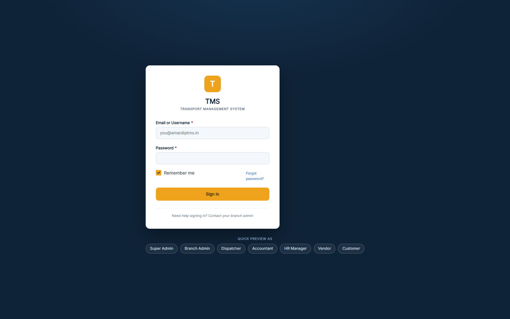

You can sign in with your full email address or just the part before the `@` —
`amardip.singh` and `amardip.singh@amardiptms.in` both work.

If your account has been suspended the screen says so. If your credentials are
wrong it says only that they were not recognised — it will not tell you whether
the address exists, which is deliberate.

**Forgot your password?** There is no self-service reset. Your branch admin
issues a new temporary password from **Administration → Users**.

### Demo accounts {-}

This build ships with generated demo data. Every seeded account uses the same
password, `tms@2026`:

```{r demo-accounts}
u <- store_get("users")
roles <- c("Super Admin", "Branch Admin", "Operations Manager",
           "Booking Executive", "Dispatcher", "Accountant", "HR Manager")
tibble::tibble(
  Role  = roles,
  Email = vapply(roles, function(r) {
    e <- u$email[u$role == r & u$status == "Active"]
    if (length(e)) e[1] else "—"
  }, character(1)),
  `Accounts` = vapply(roles, function(r) sum(u$role == r), integer(1))
) |> kable(align = "llr")
```

The **Quick preview as** chips under the sign-in card are a shortcut for
exploring: each one signs you straight in as a representative account for that
role, including the Customer and Vendor portals. They exist so you can see how
the system looks to each kind of user without juggling passwords. A real
deployment turns them off by setting `TMS_DEMO_LOGIN=false`.

# Finding your way around

## The shell

Every screen sits in the same frame, so once you have learned it you have
learned all thirty.

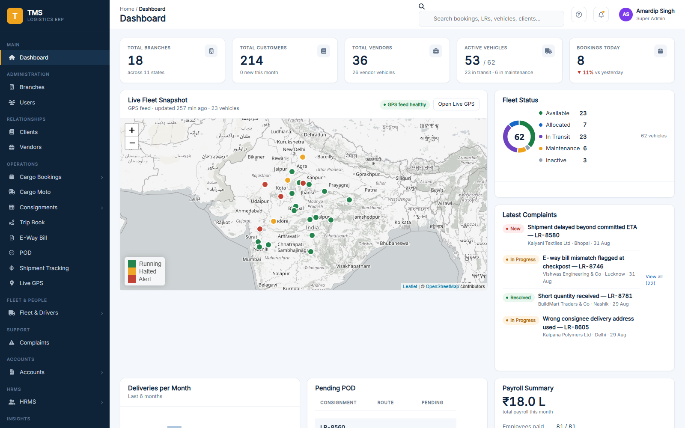

**The left rail** is your navigation, grouped by what the screens are for —
Administration, Relationships, Operations, Fleet &amp; People, Support, Accounts,
HRMS, Insights, System. Groups with a chevron expand to reveal sub-screens; only
one group is open at a time. **You will not see all of these.** The rail only
shows what your role is allowed to open, so a shorter list is normal, not a
fault.

**Your name sits at the bottom of the rail**, with your role beneath it. The
icon beside it signs you out.

**The top bar** carries a breadcrumb showing where you are, the page title,
global search, help, notifications, and your account.

## Patterns you will see everywhere

The app reuses about six layouts. Learning them here saves relearning them on
every screen.

### Stat cards {-}

A row of headline numbers across the top of a screen. The small print under each
number tells you what it is measured against — *"23 in transit · 6 in
maintenance"*, *"14% vs yesterday"*.

Cards with a **coloured left edge** are asking for attention: amber for
something approaching a deadline, red for something past it, green for something
comfortably in hand.

Where a card says **30 days** it means a rolling window ending today, not the
calendar month. That is deliberate: a month-to-date figure reads zero on the 1st
of the month, which looks like a broken feed rather than a new period.

### Tabs and filter chips {-}

Underlined **tabs** and pill-shaped **chips** both filter the list below them,
and both carry a count so you can see the shape of the work before you click.
`All 342 · Draft 18 · Confirmed 41 · …`

### Master–detail {-}

Most reference screens put a list on the left and a detail panel on the right.
**Click any row** to load it into the panel. Until you do, the panel shows a
placeholder — that is the screen waiting for you, not an error.

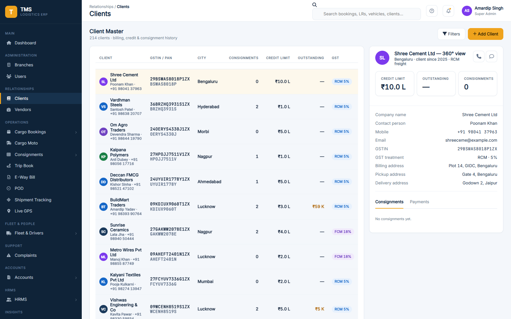

### Kanban boards {-}

Two screens — Cargo Moto and Complaints — show work as cards in columns, one
column per stage. Cards move left to right as work progresses. **Click a card**
to open its detail. A coloured stripe down the left edge of a card flags
priority or a breached deadline.

### Status pills {-}

Small coloured badges carry status everywhere in the app, and the colours mean
the same thing on every screen:

| Colour | Meaning | Examples |
|---|---|---|
| <span class="hb-pill hb-green">green</span> | Done, healthy, or available | Delivered, Paid, Available, Approved, Active |
| <span class="hb-pill hb-blue">blue</span> | Confirmed and moving | Confirmed, Vehicle Allocated, Dispatched, Sent, Verified |
| <span class="hb-pill hb-purple">purple</span> | On the road | In Transit |
| <span class="hb-pill hb-orange">orange</span> | Needs attention soon | Expiring Soon, Uploaded, Partially paid, Maintenance, On leave |
| <span class="hb-pill hb-red">red</span> | Blocked, overdue, or breached | Expired, Overdue, Cancelled, past SLA |
| <span class="hb-pill hb-grey">grey</span> | Not started, or inactive | Draft, Pending, Unassigned, Inactive |

### Timelines {-}

Where something moves through fixed stages — a consignment, a payroll run — the
app draws a vertical timeline. A green tick is a completed step, an amber
numbered dot is where the item is now, and hollow grey dots are still ahead.

### Callouts {-}

Tinted boxes explain a rule or warn about a consequence. Blue is information,
amber is a caution, red means something is blocked, green confirms.

# The core workflow

This section walks one load from order to cash. If you read nothing else, read
this — it is the job.

## Step 1 · Take the booking

**Operations → Cargo Bookings → New Booking**

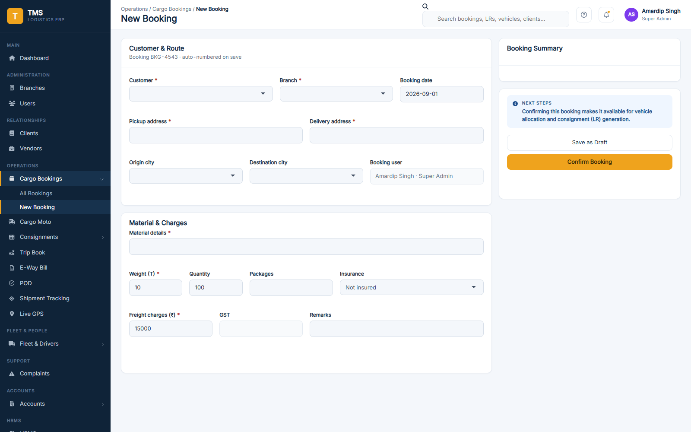

Pick the **customer** first. Doing so fills in their pickup and delivery
addresses from the customer master and sets the GST treatment for the job —
you do not choose the tax rate, it comes from the customer's record.

Fill in origin and destination. As soon as both are set, the form checks the
**pin-code route master** and tells you whether the lane is serviceable and how
many days transit you can promise. If the lane is not mapped it says so, and you
should not quote a delivery date until it is.

Then material, weight, packages, insurance and freight. The right-hand summary
totals freight + GST + insurance live.

Finish with one of two buttons:

- **Save as Draft** parks it. Drafts are not visible to dispatch and cannot be
  allocated a vehicle.
- **Confirm Booking** releases it into operations. This is the one you want when
  the customer has committed.

The booking number is allocated when you save — you do not type it.

## Step 2 · Put a truck on it

**Operations → Cargo Moto**

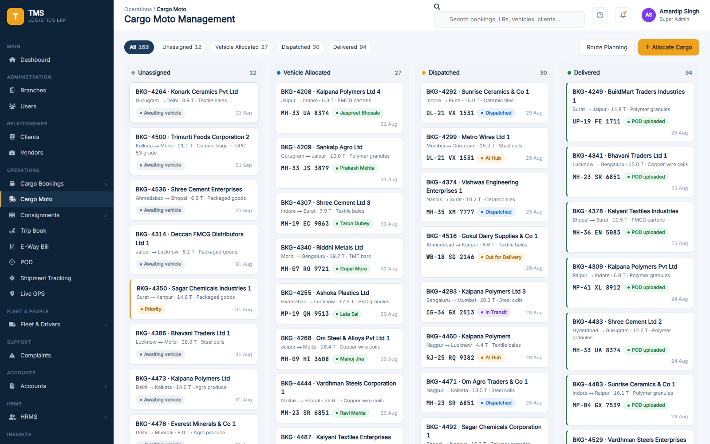

This board is the same bookings you just created, arranged by how far they have
progressed:

- **Unassigned** — confirmed, waiting for a vehicle
- **Vehicle Allocated** — truck and driver assigned, not yet moving
- **Dispatched** — on the road
- **Delivered** — arrived, POD may still be outstanding

Click **+ Allocate Cargo** (or open an unassigned card and choose *Allocate
vehicle*).

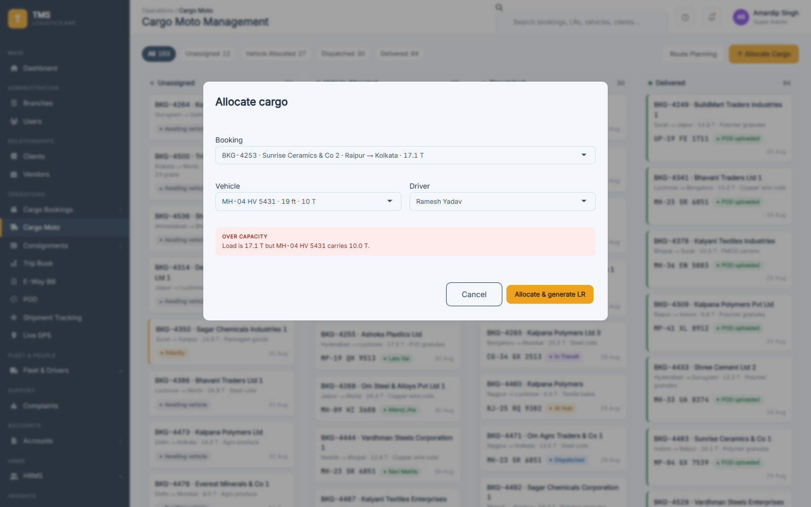

Choose the booking, a vehicle and a driver. Before you can save, the dialog
tells you what it found:

- **green** — the load fits and everything is in date; it shows you the spare
  capacity
- **amber** — the driver's licence expires within 30 days; you may proceed
- **red** — the load is heavier than the truck, or a vehicle document has
  expired; **allocation is refused**

Saving does three things at once: it creates the **trip**, generates the
**consignment and its LR number**, and moves the booking to *Vehicle Allocated*.
You do not create those separately.

## Step 3 · The consignment and its LR

**Operations → Consignments → Consignment (LR)**

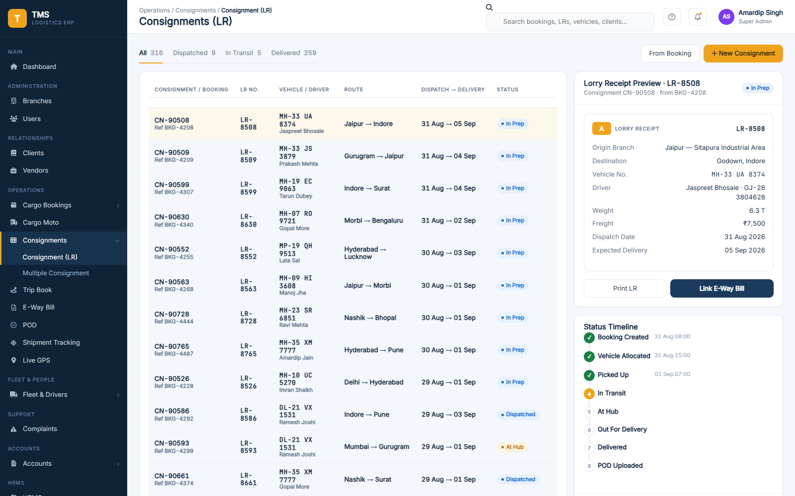

Each consignment carries **two numbers**, and they are not interchangeable:

- **CN-xxxxx** is the internal record.
- **LR-xxxx** is the **lorry receipt** — the document the driver carries and the
  consignee signs. This is the number customers quote.

Select a row and the right-hand panel shows the LR ready to print, plus a
timeline of where the consignment has got to. **Print LR** sends it to the print
queue; the driver cannot leave without it.

### Splitting and consolidating {-}

**Operations → Consignments → Multiple Consignment**

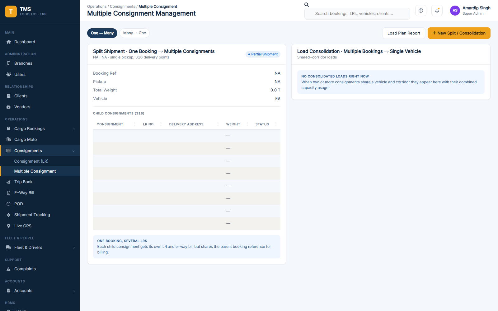

Two situations the simple one-booking-one-truck model does not cover:

- **One booking → many consignments (split).** A single pickup dropped at
  several delivery points. Each child gets its own CN and LR and its own e-way
  bill, but they all keep the parent booking reference so the customer gets one
  bill.
- **Many bookings → one vehicle (consolidation).** Several loads sharing a truck
  down the same corridor. The panel shows capacity used against capacity
  available, and warns when there is only a little headroom left before the
  dispatch cut-off.

## Step 4 · The e-way bill

**Operations → E-Way Bill**

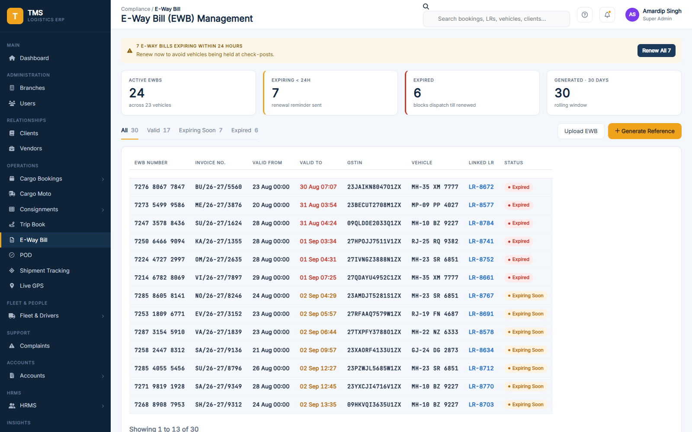

Under GST, a consignment over the threshold must carry a valid e-way bill, and
its validity is **distance-based and expires**. An expired bill gets the vehicle
held at a check-post, which is why this screen leads with the expiry queue
rather than the register.

- **Expiring < 24h** — renew these today. The banner across the top offers
  **Renew All**.
- **Expired** — the vehicle cannot legally move on that consignment until the
  bill is extended.

Extending adds validity based on the distance still to run.

Only consignments actually on the road appear here. Once a consignment is
delivered its bill is spent and drops out of the register.

> **In this build the GST Suvidha Provider is not connected.** Generating a bill
> records a locally-generated reference so the workflow is complete, but nothing
> is filed with the government portal. The screen says so when you generate.

## Step 5 · Watch it move

**Operations → Live GPS** shows the whole fleet on a map.

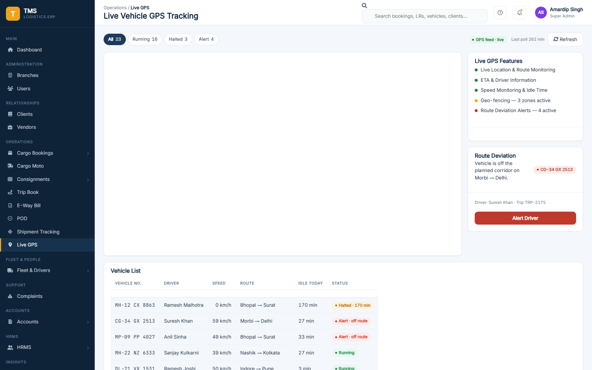

Click a vehicle for its speed, driver, route, ETA and current LR. The **Route
Deviation** panel flags any vehicle off its planned corridor and offers to alert
the driver.

**Operations → Shipment Tracking** answers the question a customer actually
asks: *where is my stuff?*

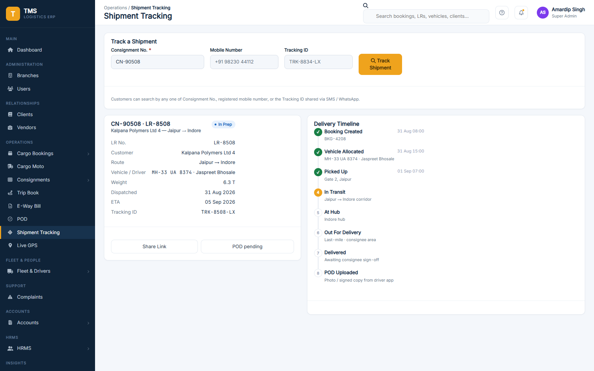

Search by consignment number, the customer's registered mobile number, or the
tracking ID that was shared with them. **Share Link** produces a read-only link
you can send the consignee — it shows status and ETA only, never pricing and
never their other shipments.

## Step 6 · Collect the proof of delivery

**Operations → POD**

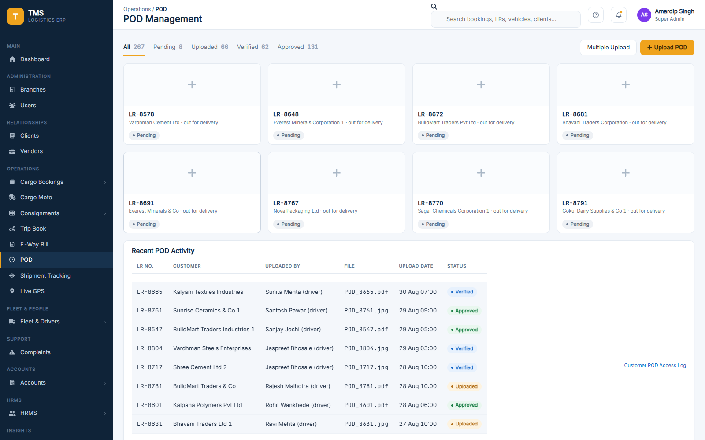

The POD is the consignee's signature confirming they received the goods. It
moves through four states:

**Pending** → **Uploaded** → **Verified** → **Approved**

The driver or vendor uploads a photo or scan; ops verifies it is legible and
matches; a supervisor approves it.

**This matters commercially, not just operationally.** You cannot invoice a
consignment until its POD is at least *Verified* — see
[Why did it say no?](#why-did-it-say-no)

## Step 7 · Raise the invoice

**Accounts → Invoices &amp; Billing**

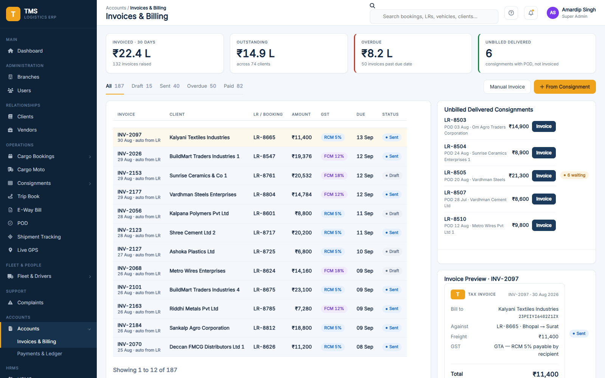

The panel on the right, **Unbilled Delivered Consignments**, is your work queue:
deliveries that are complete, have a verified POD, and have not yet been billed.
Click **Invoice** on any one of them, or use **+ From Consignment** to raise
several at once.

### About the GST column {-}

Every invoice shows either **RCM** or **FCM**. This is taken from the customer's
record and you cannot override it on the invoice:

- **RCM (reverse charge)** — the standard treatment for goods transport. **The
  carrier collects no tax.** The tax line is zero and the invoice total equals
  the freight; the customer pays the GST directly to the government. Most of
  your book will be RCM at 5%.
- **FCM (forward charge)** — you collect the tax and remit it. The invoice total
  is freight plus GST.

Ancillary charges raised through **Manual Invoice** — detention, demurrage,
loading — are a service rather than freight, and always carry forward charge at
18% whatever the customer's freight treatment is.

## Step 8 · Record the payment

**Accounts → Payments &amp; Ledger**

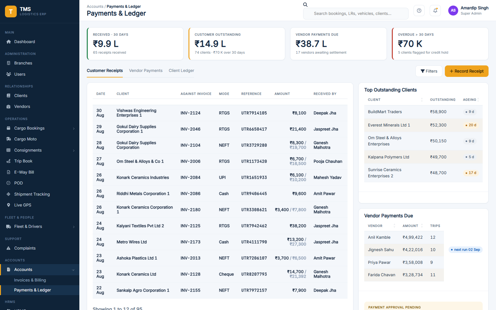

Click **+ Record Receipt** to log money received.

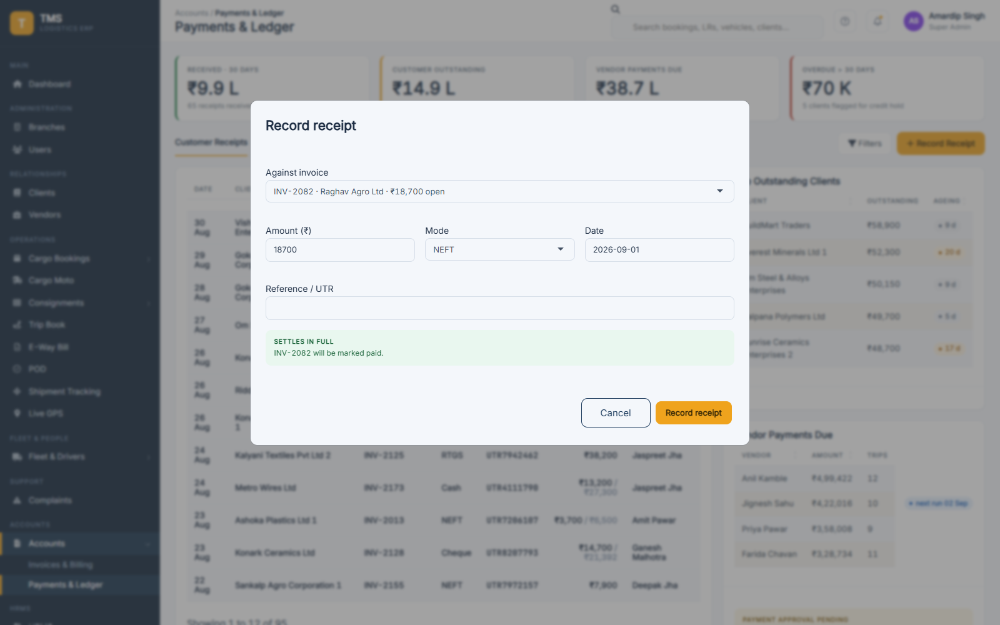

Choose the invoice; the amount defaults to the full open balance. As you change
it the dialog tells you what will happen:

- pay it in full → the invoice is marked **Paid**
- pay part → it becomes **Partially paid** and the remainder stays open
- pay more than is owed → you are warned about the over-payment

Receipts reconcile against the invoice automatically. There is no separate step
to "apply" a payment, and the outstanding figures on the customer's record, the
dashboard and this screen all recompute from the same numbers.

The **Vendor Payments** tab settles the other direction — what you owe vehicle
owners for the trips they ran. Payments above ₹50,000 need branch admin approval
before the payment run.

# Every screen, group by group

## Administration

### Dashboard {-}

Your landing page. Fleet snapshot on a live map, fleet status breakdown, latest
complaints, deliveries trend, PODs outstanding, and a payroll summary.

If you are scoped to one branch, every figure here is your branch only.

### Branches {-}

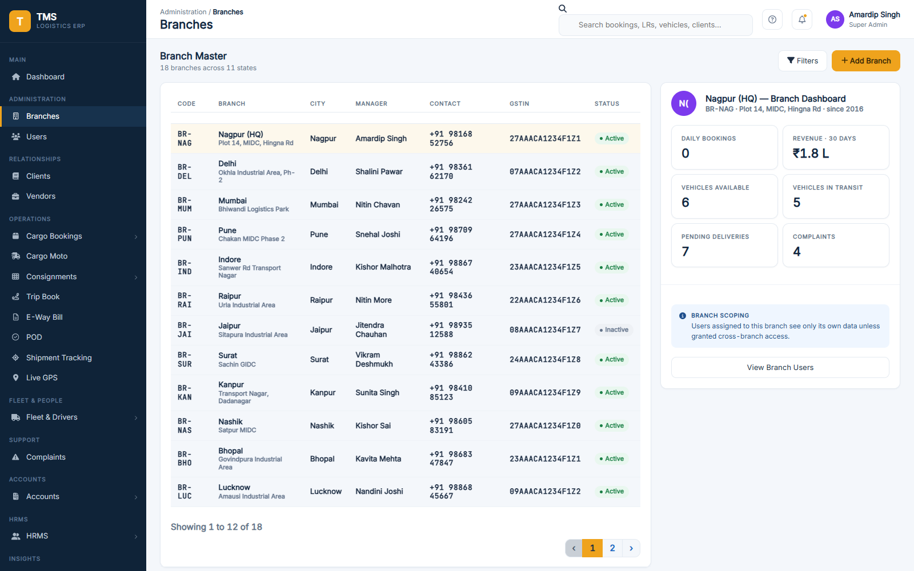

The branch master, with a per-branch dashboard on selection: today's bookings,
revenue, vehicle availability, pending deliveries and open complaints — all
computed live, so this and the operations screens can never disagree.

### Users {-}

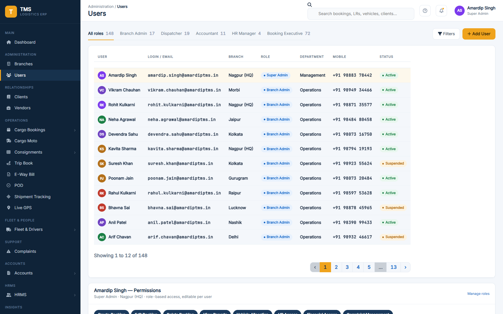

Internal logins. Selecting a user shows what their role permits — create
bookings, allocate vehicles, see financials, and so on. Those capabilities come
from the role's entry in the permission matrix; to change them, change the role
under **System → Security &amp; Roles**.

New users are created with a temporary password that must be changed at first
sign-in. Tick **cross-branch access** only when someone genuinely needs to see
beyond their own branch.

## Relationships

### Clients {-}

The customer master. Each record carries billing and delivery addresses, credit
limit, **GST treatment** (which flows onto every booking and invoice) and a 360°
view with consignment and payment history.

Outstanding balance is calculated from unpaid invoices, never stored — it cannot
go stale when a payment lands.

### Vendors {-}

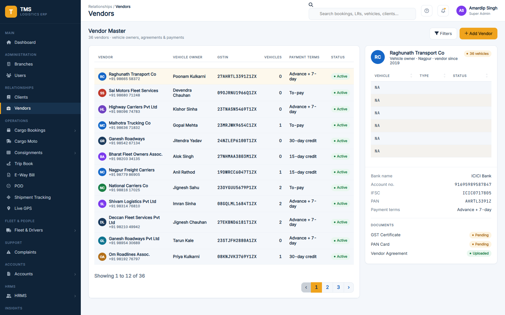

Vehicle owners who run trips for you. The panel shows the vehicles registered to
them, their bank details for settlement, document status (agreement, PAN, GST
certificate) and what they are currently owed.

## Operations

### Cargo Bookings {-}

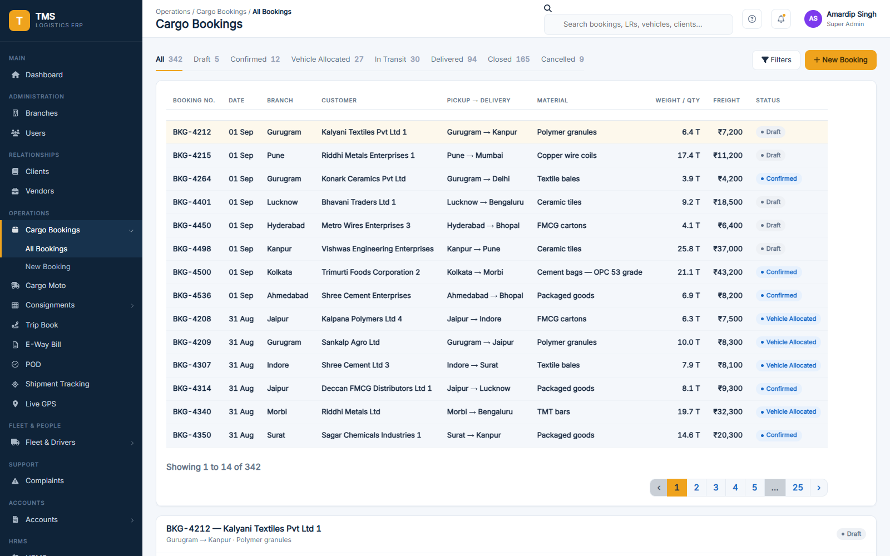

The register of everything ordered. The tabs across the top filter by lifecycle
stage — **Draft, Confirmed, Vehicle Allocated, In Transit, Delivered, Closed,
Cancelled** — with a count on each, so you can see the shape of the pipeline
before clicking into it.

Select a row and a strip appears underneath showing the charge breakdown and,
once allocated, the trip, vehicle, driver and LR. A booking that has not been
allocated says so and points you at Cargo Moto.

This is the screen to reach for when a customer rings up about an order: filter
or search, click the row, and everything about that job is in front of you.

### Trip Book {-}

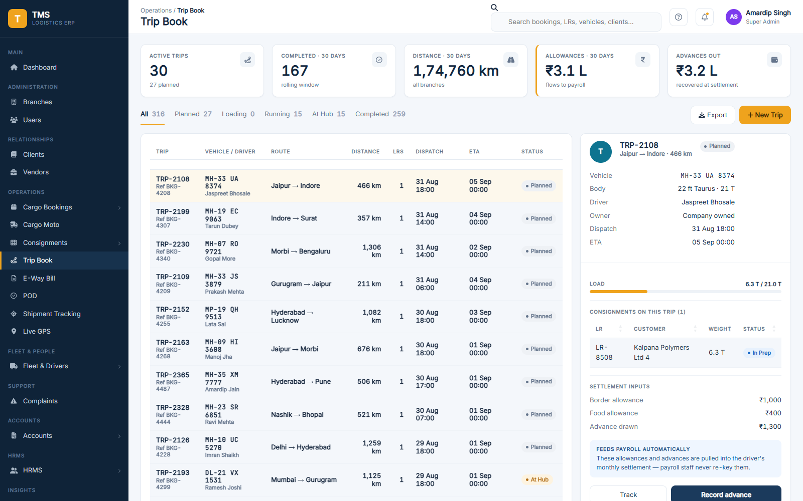

A **trip** is one vehicle and one driver moving between two points. It is
created for you when you allocate a vehicle, and it is where two things live
that matter elsewhere:

- **Allowances** — a fixed border and food allowance per trip, which payroll
  pulls automatically into the driver's monthly settlement.
- **Advances** — the float the driver drew for tolls, fuel and food, recovered
  at settlement. Record one with **Record advance** on the trip panel.

A trip also groups consignments, which is how consolidated loads are tracked.

If a payroll figure ever looks wrong, this is where to check its provenance.

## Fleet &amp; People

### Vehicles {-}

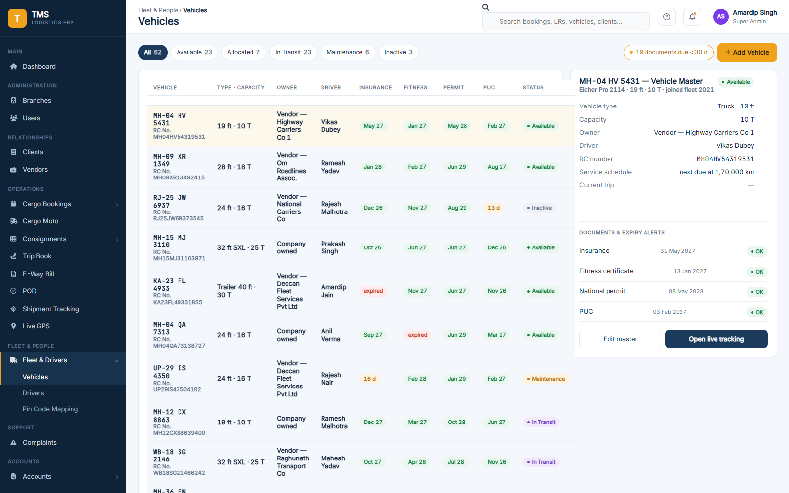

The fleet register. Four statutory documents are tracked per vehicle —
**insurance, fitness, national permit and PUC** — and each shows a colour-coded
expiry badge: green in date, amber within 30 days, red expired.

**An expired document blocks allocation.** Keeping these current is what keeps
trucks earning.

### Drivers {-}

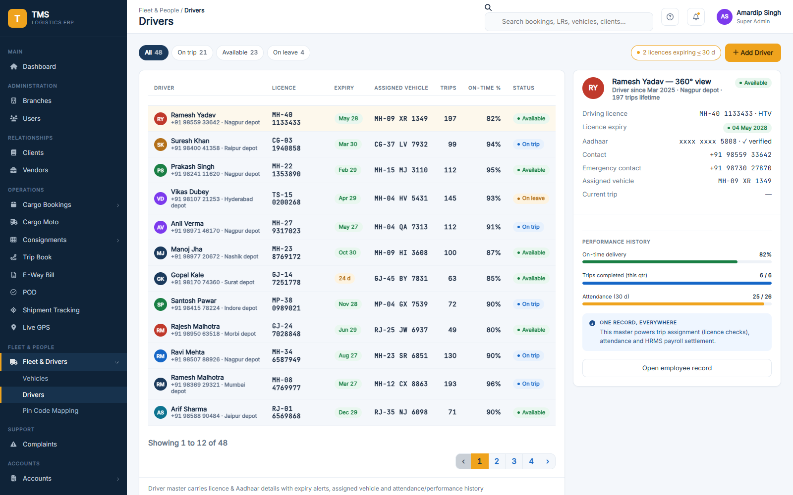

Licence details with expiry alerting, assigned vehicle, depot, and performance
history — on-time delivery, trips completed this quarter, attendance.

**A driver is an employee.** This screen is the driving-specific extension of
their HR record, not a separate person. To add a driver, the person must already
exist under **HRMS → Employees**; the form will tell you so.

### Pin Code Mapping {-}

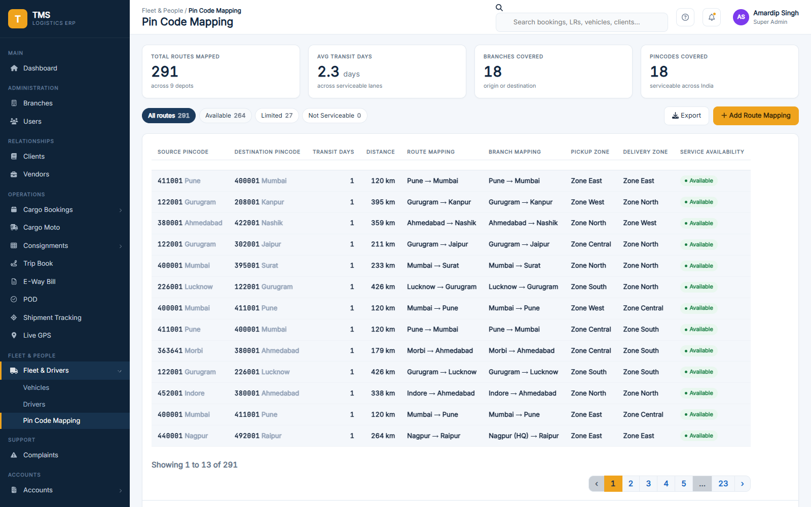

Which lanes you serve, how long they take, and which depots a load routes
through. This is what the booking form checks when it tells you a lane is
serviceable and how many days to promise.

Three availability states: **Available**, **Limited** (longer transit, fewer
departures) and **Not Serviceable**. Adding a lane here makes it quotable
immediately.

## Support

### Complaints {-}

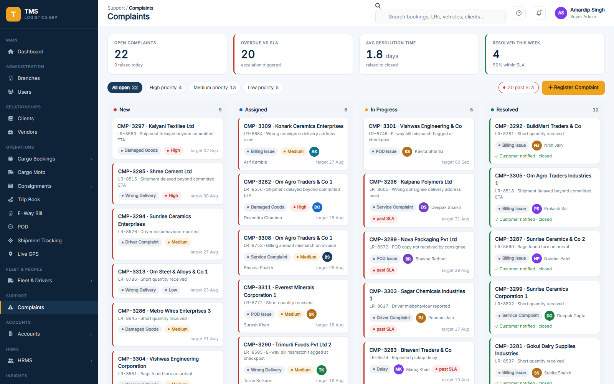

A board running **New → Assigned → In Progress → Resolved**, with an SLA of two
days from being raised (one day for high priority). Cards past SLA get a red
stripe and the count appears in the header.

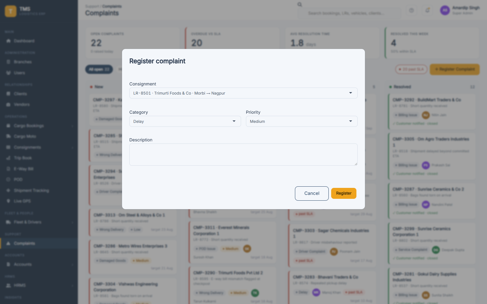

Register a complaint against a specific consignment so it is linked to the job
it concerns. Resolving one requires a resolution note — you cannot close a
ticket silently.

## HRMS

### Employees {-}

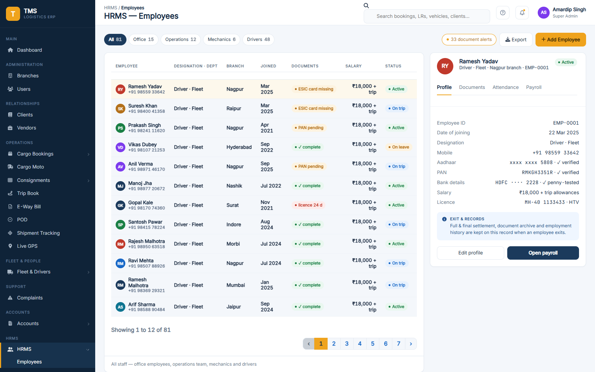

Everyone on the payroll. The tabs on a selected employee cover profile,
documents, attendance and payroll. Document alerts flag missing paperwork and
expiring licences.

### Attendance &amp; Leave {-}

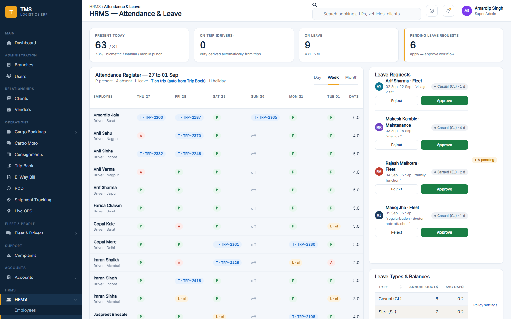

A day/week/month register using: **P** present, **A** absent, **L** leave,
**T** on trip, **H** holiday.

**Drivers do not punch in.** A driver's duty day comes from the Trip Book — if
they were on a trip, that day is marked **T** automatically. Nobody on the road
gets marked absent for failing to clock in.

Leave requests appear on the right for approval. If a driver has a trip booked
inside the requested dates, the request is flagged so you check the roster
before approving. Approving a request writes the leave days into the register,
which is what payroll then reads.

### Payroll {-}

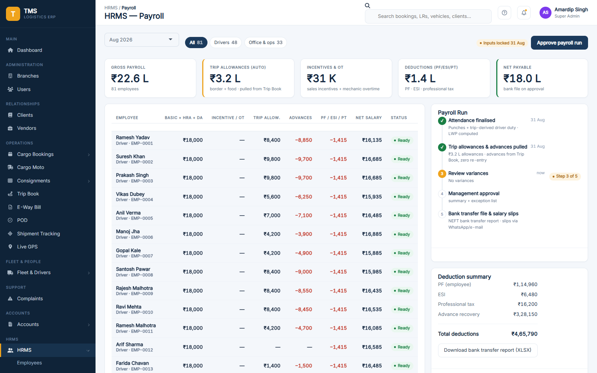

Payroll runs for the **month that has closed**, not the one in progress —
attendance has to be final and allowances totalled before anyone can be paid. On
the 1st of September you are working on August.

The **Trip Allowances (auto)** column is the point of the screen: those figures
come from the Trip Book and nobody re-keys them. Advances are recovered the same
way.

Deductions applied are PF at 12% of basic, ESI where the salary is within the
coverage ceiling, and professional tax.

The run moves through five steps shown on the right. Anyone with a settlement
variance is held back and listed at step 3; approving the run pays everyone else
and leaves the exceptions for follow-up.

## Insights

### Reports &amp; Analytics {-}

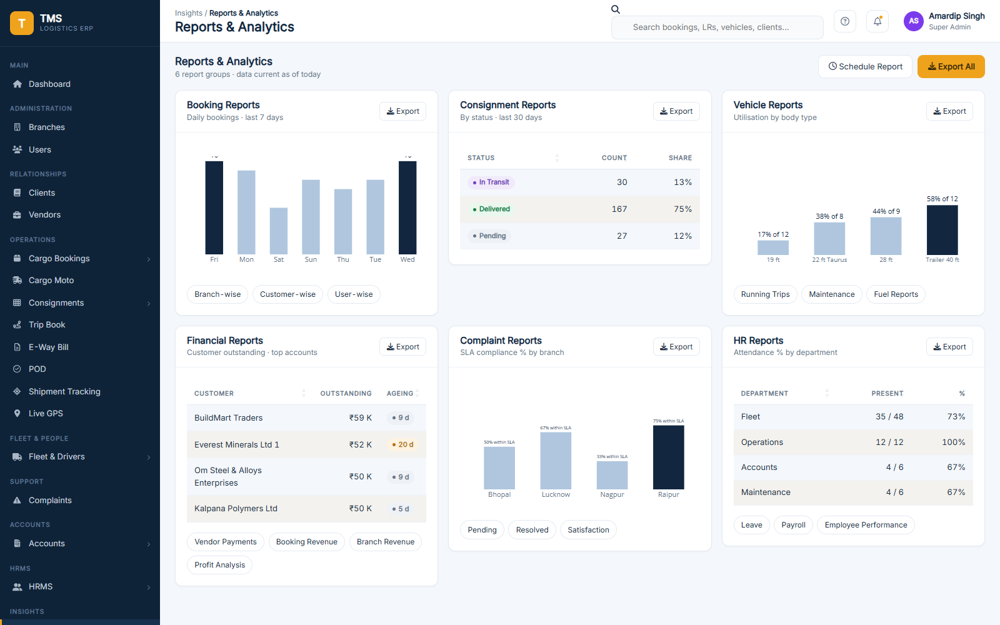

Six groups — bookings, consignments, vehicles, financial, complaints and HR.
Every one exports to Excel, and every figure is computed live from operational
data rather than a nightly snapshot, so an exported number always matches what
was on screen.

**Schedule Report** records a recurring delivery, but reports will only actually
be sent once an email gateway is connected.

## Portals

Three read-mostly dashboards for three audiences.

### Branch Dashboard {-}

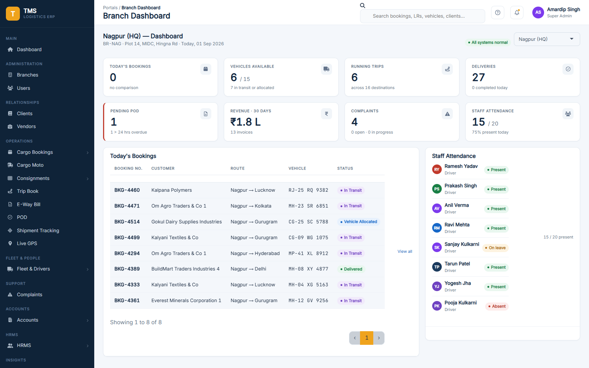

Today's operating picture for a single branch: bookings, vehicle availability,
running trips, deliveries, POD backlog, revenue, complaints and staff
attendance. Users with cross-branch access get a branch switcher.

### Customer Dashboard {-}

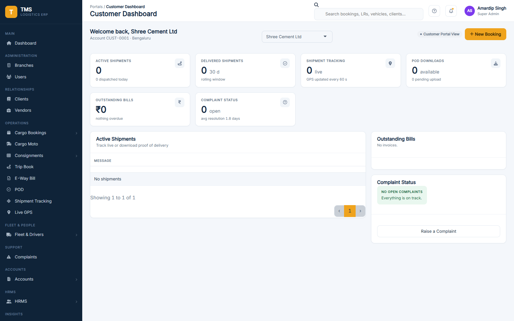

A customer's self-service view: active shipments with live tracking, POD
downloads, outstanding bills and complaint status.

A customer signed in to this portal can only ever see **their own** rows. That
restriction is applied to the data itself, not by hiding buttons.

### Vendor Dashboard {-}

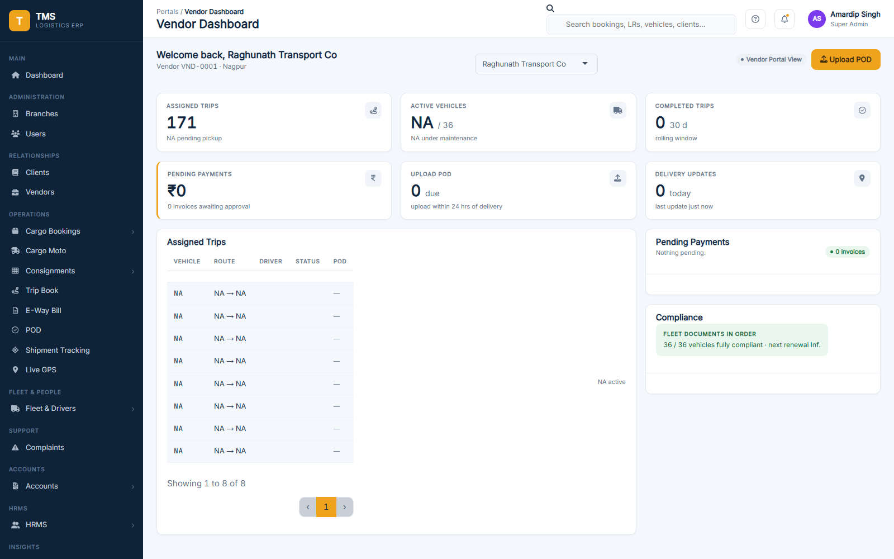

For vehicle owners: trips assigned to them, PODs they owe, payments pending, and
whether their fleet documents are in order.

## System

### Security &amp; Roles {-}

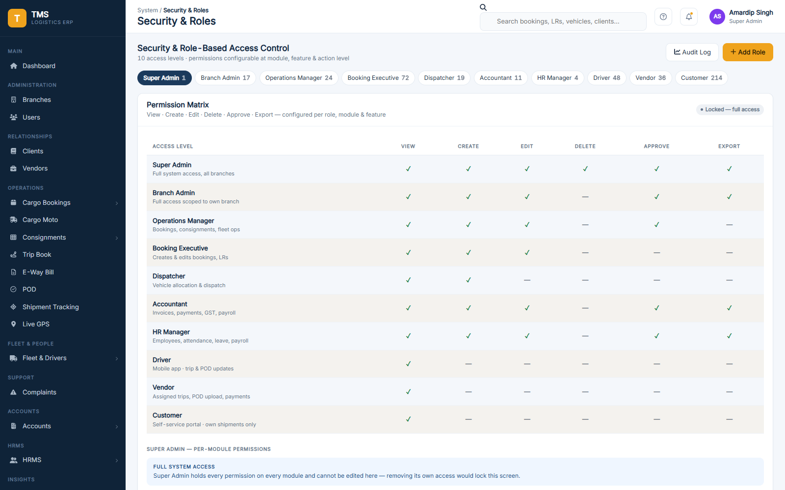

The permission matrix. Ten access levels, six actions (view, create, edit,
delete, approve, export), configurable per module. Pick a role from the chips to
edit its per-module grid.

**Super Admin cannot be edited** — removing its own access would lock everyone
out of this screen.

**Audit Log** shows who did what, and when.

### Settings {-}

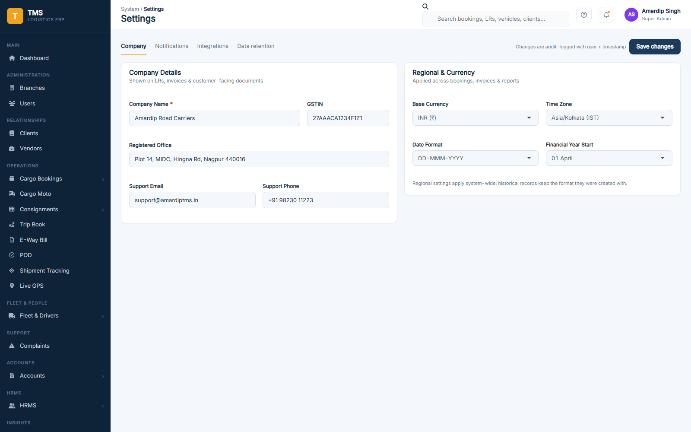

Four tabs: company details (which appear on LRs and invoices), notification
routing per event and channel, integrations, and data retention periods.

Financial records are fixed at eight years and cannot be shortened — statute,
not preference.

> **On integrations:** every connector ships disconnected and **no credentials
> are stored in the application.** A real deployment supplies them as
> environment variables; this screen names them but never asks you to paste a
> key into a form.

# Roles and what they can see

## The ten access levels

```{r roles-table}
r <- store_get("roles")
p <- store_get("permissions")
if (!nrow(p)) p <- DEFAULT_PERMISSIONS

acts <- function(role) {
  pr <- p[p$role == role, ]
  if (!nrow(pr)) return("—")
  got <- ACTIONS[vapply(ACTIONS, function(a)
    any(as.numeric(pr[[a]]) == 1, na.rm = TRUE), logical(1))]
  paste(got, collapse = ", ")
}
n_modules <- function(role) sum(vapply(MODULES, function(m) can(role, m, "view"), logical(1)))

tibble::tibble(
  Role = r$role,
  `What it is for` = r$description,
  `Screens` = vapply(r$role, n_modules, integer(1)),
  `Can` = vapply(r$role, acts, character(1))
) |> kable(align = "llrl")
```

Three of these — Driver, Vendor and Customer — are not internal staff logins.
They are external parties reaching the system through a portal, and their
numbers reflect how many drivers, vendors and customers exist rather than how
many office accounts there are.

## What a narrower role looks like

The navigation rail shows only what you can open. An accountant, for example,
sees the money and the masters behind it, but not the dispatch board or the GPS
feed:

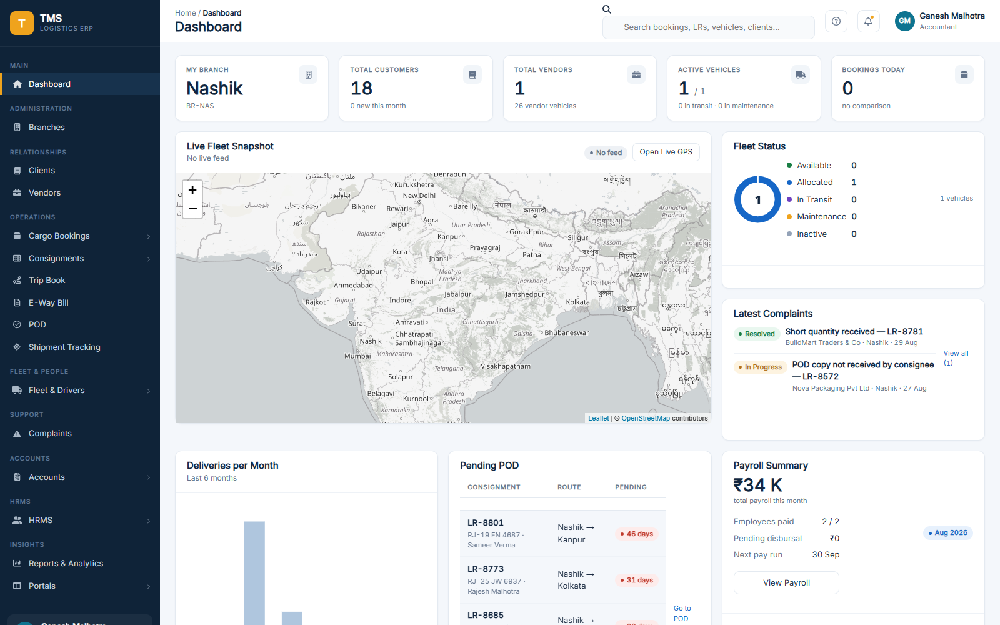

And an external party sees almost nothing but their own dashboard:

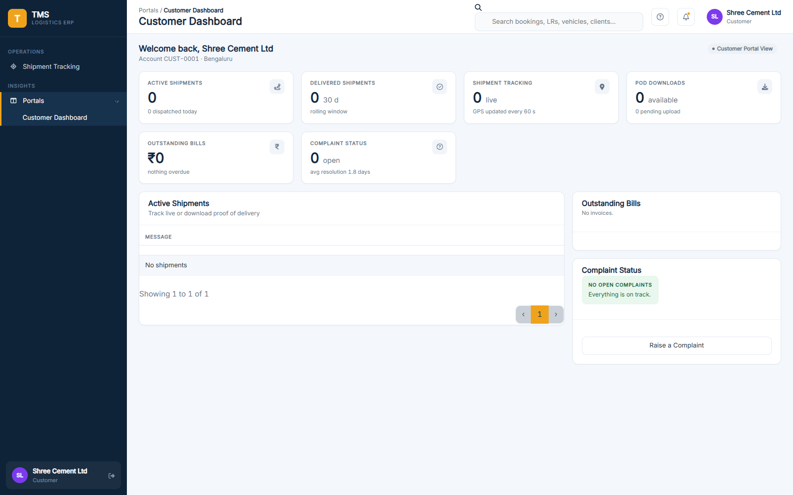

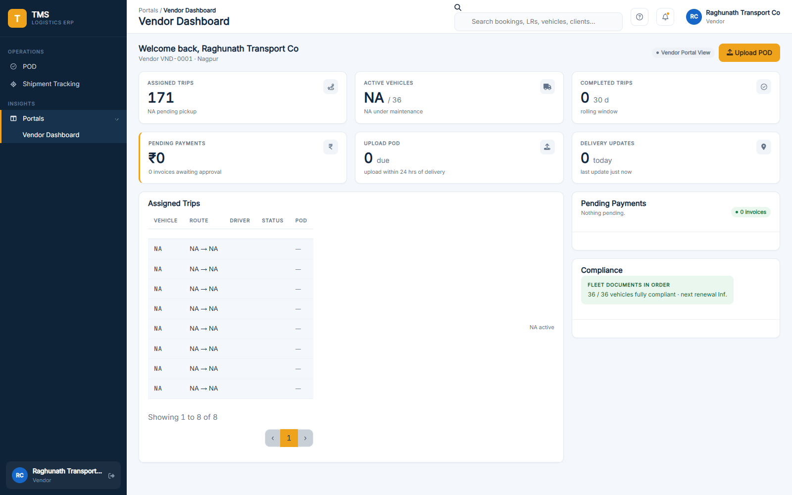

## Branch scoping

Separately from your role, most users are **scoped to one branch**. Your lists,
your dashboard cards and your charts all show your branch's slice only.

This is applied to the data before it reaches the screen, so there is no view
that leaks past it. If you genuinely need to see across branches, a Super Admin
can grant **cross-branch access** on your user record.

# Why did it say no? {#why-did-it-say-no}

Five things the system will refuse to do, and the reason for each. None of them
is a bug.

**"Cannot invoice: this consignment has no verified POD."**
Billing for a delivery you cannot prove happened is how disputes start. Get the
POD uploaded and verified first. The check is re-run at the moment you click, so
a stale screen will not sneak one through.

**"Cannot allocate: load exceeds vehicle capacity."**
The booking is heavier than the truck's rated capacity. Pick a bigger vehicle or
split the load into multiple consignments.

**"Vehicle documents expired."**
Insurance, fitness, permit or PUC has lapsed. The vehicle is not legal on the
road; renew it under **Fleet &amp; Drivers → Vehicles** before allocating.

**"Licence expired"** / **"Licence expiring."**
Expired refuses the allocation. Expiring within 30 days warns but lets you
proceed — treat it as a prompt to get the renewal moving.

**"Your role is not permitted to …"**
The action is outside your permission set. This is checked on the server, so it
holds regardless of what is on screen. Ask a Super Admin if you think your role
is wrong.

# Frequently asked

**Why is a number here different from the same number over there?**
It should not be. Every figure is computed from the same underlying records
rather than stored separately. If two screens genuinely disagree, that is worth
reporting.

**Why does a card say "30 days" instead of "this month"?**
Because a month-to-date figure is zero on the 1st, which reads as a broken feed.
Rolling windows always have content. Genuinely monthly things — the payroll run,
the deliveries-per-month chart — still use calendar months.

**I confirmed a booking. Why can't dispatch see it?**
Check it is *Confirmed* and not still *Draft*, and that it belongs to the branch
the dispatcher is scoped to.

**A consignment shows two numbers. Which do I give the customer?**
The **LR number**. That is what is printed on the lorry receipt they signed.

**The customer says they never got the POD.**
Check the POD status on the consignment. If it is uploaded, they can download it
themselves from the customer portal, or you can send a tracking link.

**Why is my driver marked "T" instead of present?**
They were on a trip that day. Driver duty is derived from the Trip Book so
nobody on the road is marked absent for not clocking in. It counts as a duty day
for payroll.

**Nothing was actually emailed / no SMS went out.**
Correct — the messaging gateways are not connected in this build. The app tells
you when an action depends on one.

# Glossary

| Term | Meaning |
|---|---|
| **Booking (BKG)** | A customer's order to move a load. The start of the chain. |
| **Consignment (CN)** | The internal record of goods moving on one trip. |
| **LR — Lorry Receipt** | The document travelling with the goods, signed by the consignee. The number customers quote. |
| **Trip (TRP)** | One vehicle and driver moving between two points. Carries allowances and advances. |
| **POD — Proof of Delivery** | The signed confirmation that goods were received. Gates invoicing. |
| **E-way bill (EWB)** | GST document that must accompany goods above a value threshold. Distance-based validity; expires. |
| **GTA** | Goods Transport Agency — the GST classification for a road-freight carrier. |
| **RCM — Reverse Charge** | The recipient pays the GST, not the carrier. Carrier's invoice shows zero tax. Standard for freight at 5%. |
| **FCM — Forward Charge** | The carrier collects the GST and remits it. 12% or 18%. |
| **GSP** | GST Suvidha Provider — the gateway through which e-way bills are filed. |
| **PUC** | Pollution Under Control certificate. One of four statutory vehicle documents. |
| **Fitness certificate** | Roadworthiness certification for a commercial vehicle. |
| **National permit** | Authorisation to run a goods vehicle across states. |
| **MXL / SXL** | Truck body types. MXL is the longer container body; both commonly 32 ft. |
| **Consolidation** | Several bookings sharing one vehicle down a common corridor. |
| **Split shipment** | One booking dropped at several delivery points, each with its own LR. |
| **Detention charge** | Billed when a vehicle is held at loading or unloading beyond free time. |
| **SLA** | Service level agreement — the deadline a complaint must be resolved within. |
| **Branch scoping** | Restriction of a user's view to their own branch's data. |
| **LWP** | Leave without pay. |
| **PF / ESI / PT** | Provident Fund, Employees' State Insurance, Professional Tax — statutory payroll deductions. |

# Appendix

## What is in the demo data

```{r data-summary}
tibble::tibble(
  Records = c("Branches", "Internal users", "Employees", "Drivers", "Vehicles",
              "Customers", "Vendors", "Routes mapped", "Bookings", "Trips",
              "Consignments", "E-way bills", "PODs", "Invoices", "Receipts",
              "Complaints"),
  Count = c(n_of("branches"), n_of("users"), n_of("employees"), n_of("drivers"),
            n_of("vehicles"), n_of("clients"), n_of("vendors"),
            n_of("pincode_routes"), n_of("bookings"), n_of("trips"),
            n_of("consignments"), n_of("ewaybills"), n_of("pods"),
            n_of("invoices"), n_of("payments"), n_of("complaints"))
) |> kable(align = "lr", format.args = list(big.mark = ","))
```

All of it is fictional. Names, GSTINs, PANs, bank accounts and phone numbers are
generated from fixed patterns and belong to no real person or company.

## Running the system yourself

Install dependencies, then start the app:

```bash
Rscript install_packages.R
```

```bash
Rscript -e "shiny::runApp('.', port = 8788, launch.browser = TRUE)"
```

Regenerate the demo data at any point — this resets everything to a clean state:

```bash
Rscript R/seed.R
```

Run the automated checks:

```bash
Rscript tests/smoke.R
```

Refresh the screenshots in this handbook after a UI change (with the app
running):

```bash
cd tools && npm install && node capture-screenshots.js
```

Rebuild this handbook:

```bash
Rscript -e "rmarkdown::render('HANDBOOK.Rmd')"
```

## Where to look next

- **README.md** — installation, architecture and project layout.
- **DESIGN-REVIEW.md** — the review of the original design deck, every ambiguity
  found in it, and the decision taken for each. Read this if you want to know
  *why* something works the way it does.

---

<div class="hb-foot">
TMS · Transport Management System — generated `r format(Sys.time(), '%d %B %Y at %H:%M')`
</div>
